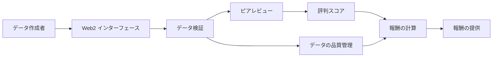
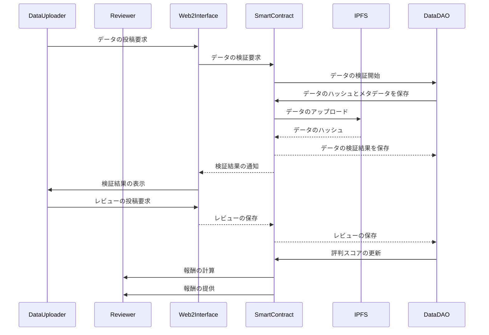
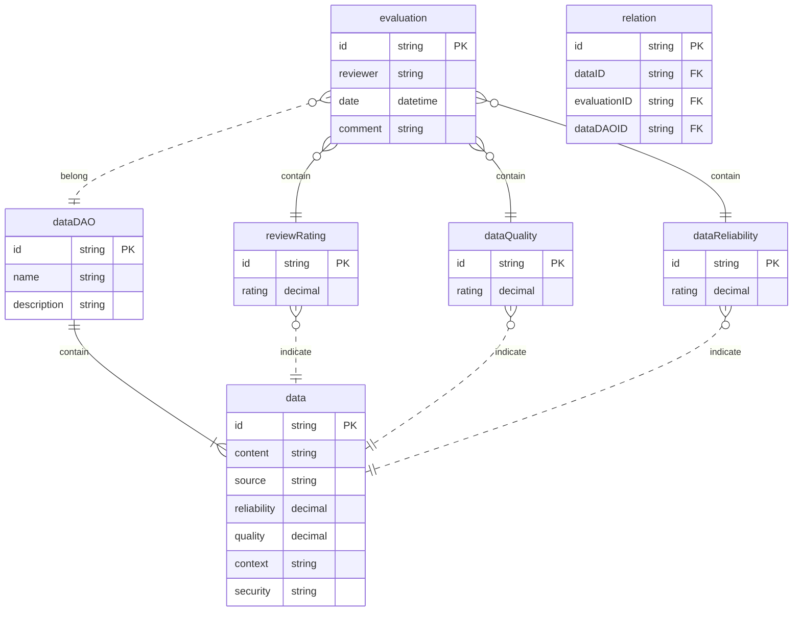

# HackFS2023DataVerification/Repuration Extend for DataDAO
DataVerification and Reputation System

## Basic ideas







## Data Verification
### Step1:  Verification
---
(EN)
Validation requests for data are conducted to verify the reliability and validity of the data provided by the data submitter. Specifically, the following verifications are performed:

1. Validation of data integrity: Ensuring that the provided data is not missing or tampered with.
2. Validation of data format: Confirming that the data follows the specified format or schema.
3. Validation of data metadata: Verifying that the relevant information and attributes associated with the data are accurately provided.
4. Validation of data documentation: Confirming that appropriate descriptions or documentation regarding the data are provided.
5. Duplicate data checking: Checking for duplicates or similarities with existing data and removing duplicated data.

These verifications are crucial to ensure the quality and reliability of the data. Validation requests are processed by smart contracts or related systems, and the validation results are communicated to the data submitter.

---
(JP)
データの検証要求は、データを投稿する人が提供したデータの信頼性と正当性を確認するために行われるものです。具体的には、以下のような検証です：

1. データの完全性の検証: 提供されたデータが欠損や改ざんされていないことを確認します。
2. データの形式の検証: データが指定されたフォーマットやスキーマに従っていることを確認します。
3. データのメタデータの検証: データに関連する情報や属性が正確に提供されていることを確認します。
4. データのドキュメンテーションの検証: データに関する説明やドキュメントが適切に提供されていることを確認します。
5. データの重複チェック: 既存のデータとの重複や類似性を確認し、重複したデータの排除を行います。

これらの検証は、データの品質や信頼性を保証するために重要です。データの検証要求は、スマートコントラクトや関連するシステムによって処理され、検証結果がデータの投稿者に通知されます。

### Step2:  Reputation
---
(EN)
Validation by reviewers complements the first-level validation and allows for more detailed verification and assessment. Here are some examples of the aspects of validation by reviewers and the resulting outcomes:

1. Quality assessment of data: Reviewers evaluate the quality and accuracy of the data, identifying inaccurate information or errors. As a result, a quality score or reliability level for the data should be assessed and stored in the data DAO (Decentralized Autonomous Organization).

2. Verification of data reliability: Reviewers investigate the sources and reliability of the data, confirming its validity. For example, they verify if the data is obtained from official sources or provided by trusted data providers. The verification results should be evaluated as a reliability score for the data and stored in the data DAO.

3. Confirmation of data context: Reviewers understand the background and context of the data, ensuring appropriate interpretation. They verify specific conditions, constraints, metadata information, and other aspects of the data. The verification results should serve as guidelines for interpreting and using the data, stored in the data DAO.

4. Security verification of data: Reviewers evaluate the security and privacy aspects of the data, verifying the confidentiality and protection of personal information. Security-related verification results should be reflected in the access rights and security policies for the data, stored in the data

---
(JP)
レビューワーによる検証は、1次元検証を補完し、より詳細な検証や判断を行うことを意味します。以下に、レビューワーによる検証の観点とその結果についていくつかの例を示します。

1. データの品質評価: レビューワーはデータの品質や精度を評価し、不正確な情報やエラーを特定します。結果として、データの品質スコアや信頼性レベルが評価され、データDAOに保存されるべきです。

2. データの信頼性の確認: レビューワーはデータのソースや信頼性を調査し、データの正当性を確認します。例えば、データが公式な情報源から取得されているか、信頼できるデータ提供者から提供されているかを検証します。検証結果はデータの信頼性スコアとして評価され、データDAOに保存されるべきです。

3. データのコンテキストの確認: レビューワーはデータの背景やコンテキストを理解し、適切な解釈を行います。例えば、データの特定の条件や制約、メタデータ情報などを検証します。検証結果はデータの解釈や使用方法の指針としてデータDAOに保存されるべきです。

4. データのセキュリティの確認: レビューワーはデータのセキュリティやプライバシーに関する観点を評価し、データの機密性や個人情報の保護について検証します。セキュリティに関する検証結果はデータのアクセス権やセキュリティポリシーの設定に反映され、データDAOに保存されるべきです。

これらの検証結果は、データの信頼性や品質の向上に貢献し、データDAOの中でのデータの価値や優先度を決定するために活用されます。データDAO内での保存方法は、検証結果や評価指標をデータとして記録し、関連するデータと一緒に保存することが一般的です。


<!-- 


```mermaid

```mermaid


```
```

```mermaid

``` -->
