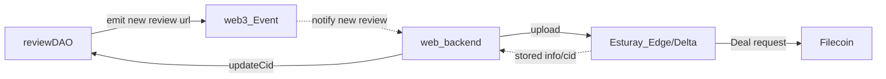

# backend for DataTrustedGraph+

## preaparation

* install mongo
   * https://www.mongodb.com/docs/manual/tutorial/install-mongodb-on-os-x/
```shell
brew tap mongodb/brew
brew install mongodb-community@6.0
mongod -f /opt/homebrew/etc/mongod.conf
#  log dir : /opt/homebrew/var/log/mongodb/mongo.log
```


## need to set web3 storage token
Get your own token on https://web3.storage/account/
or ask to kozayupapa

## create .env
copy dotenv.example to .env
and set WEB3STORAGE_TOKEN

## run  develop
`npm run serve`

## example
* simple review post
```shell
(base) backend % curl -X POST -H 'Content-Type: application/json; charset=UTF-8' http://localhost:4000/api/v1/review -d '{"title":"hogehoge","contents":"fugafuga","user": "kozayupapa"}'
{"url":"https://bafybeiafgae7xlwgkjrm6gjaibse7vn5cxwh5m7vc3paumoohm4mekdpj4.ipfs.w3s.link/review.json"}%      
```

## Store monitor

reffering ttps://github.com/hammertoe/fdt-deal-monitor.git
see  [monitor worker](./server/worker/index.ts)

It works as following



to enable the worker, should setup following env values

```shell
#setting for store monitor worker, set env and uncomment RUN_MONITOR
#RUN_MONITOR=true
PRIVATE_KEY=
rpcEndpoint = http://127.0.0.1:1234/rpc/v1
chainId=31415926
contractAddress = 
#Estuary API key
apiEndpoint = https://hackfs-coeus.estuary.tech/edge/api/v1
API_KEY = 
```
### private_key
* monitor will call review DAO update CID
* on proto , setup own develop private key,  on future change to AA key.

### rpcEndpoint & chainId
* depends on Contract to local or Calibration(test-net) or FVM main

### contractAddress
* deployed [EdgeURContract](../review-dao/contracts/EdgeURContract.sol)
* depends on network

### apiEndpoint & API_KEY
see
* EdgeUR : https://docs.filecoindata.tools/about/edge-ur/overview-of-edge-ur
* Delta: https://docs.filecoindata.tools/about/delta-tech-stack/getting-started-with-delta/use-delta

* generate API_KEY: https://auth.estuary.tech/register-new-token